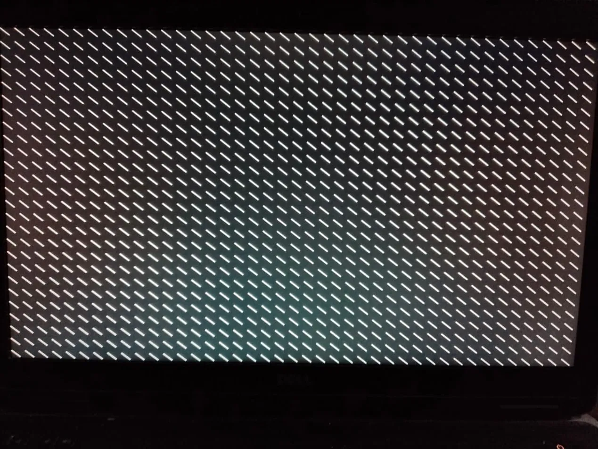

# ASA OS

> An operating system I'm building from scratch to deeply understand how computers and operating systems work.

I'm building it from the lowest level I can, starting from the boot process and gradually moving toward graphics, input, memory management, interrupts, processes, and eventually a usable system.

## Current Progress

### Booting

- [x] Multiboot bootloader integration
- [x] Custom `multiboot_info` structure
- [x] Kernel entry point
- [x] Passing the Multiboot structure from the bootloader to the kernel

### Graphics

- [x] Multiboot framebuffer detection
- [x] Direct framebuffer access
- [x] Pixel rendering
- [x] Rectangle drawing
- [x] Bresenham line drawing
- [ ] More graphics primitives
- [ ] Bitmap/font rendering
- [ ] Graphics abstraction layer

### Coming Next

- [ ] Keyboard input
- [ ] Interrupt handling
- [ ] GDT / IDT
- [ ] Memory management
- [ ] Heap
- [ ] Paging
- [ ] Processes / scheduling
- [ ] Filesystem
- [ ] Shell
- [ ] User-space programs

## Building

You need a Linux system with a 32-bit compilation toolchain, GNU assembler/linker, and GRUB.

Build the kernel:

```bash
make
```

This produces `mykernel.bin`. Verify it's a valid multiboot kernel before doing anything else with it:

```bash
grub2-file --is-x86-multiboot mykernel.bin && echo "OK"
```

(some distros call this `grub-file` instead of `grub2-file`)

## Running it

This boots a kernel directly via GRUB, with no OS underneath it. Have a way to recover (a live USB) before your first boot, in case something goes wrong.

Install the built kernel:

```bash
sudo make install
```

This copies `mykernel.bin` to `/boot/mykernel.bin`.

Add a GRUB menu entry "each one in a separate line":

​```
menuentry "ASA OS" { 
    insmod multiboot 
    multiboot /boot/mykernel.bin 
    boot
}
​```

On Fedora, add this to `/etc/grub.d/40_custom`, then regenerate the config with:
```bash
sudo grub2-mkconfig -o /boot/grub2/grub.cfg
```

On other distros, the config may live directly in `/boot/grub/grub.cfg` instead.

Reboot, and "ASA OS" should appear as a boot option — select it and it'll boot straight into the kernel.
and u should see something like: 

